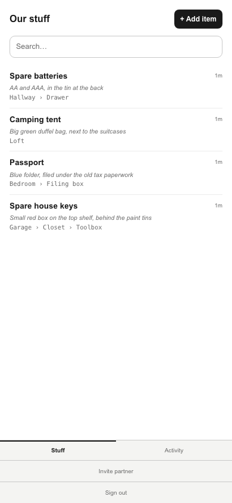
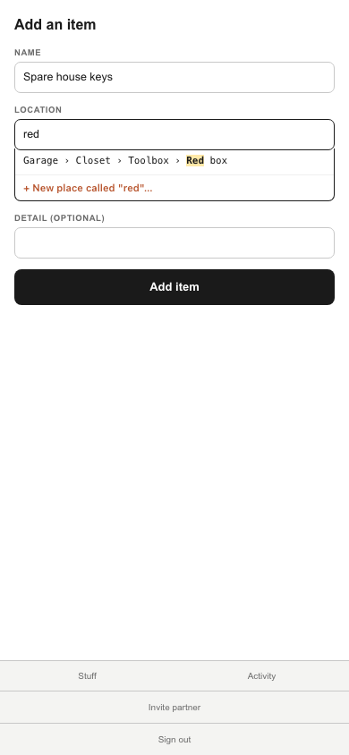
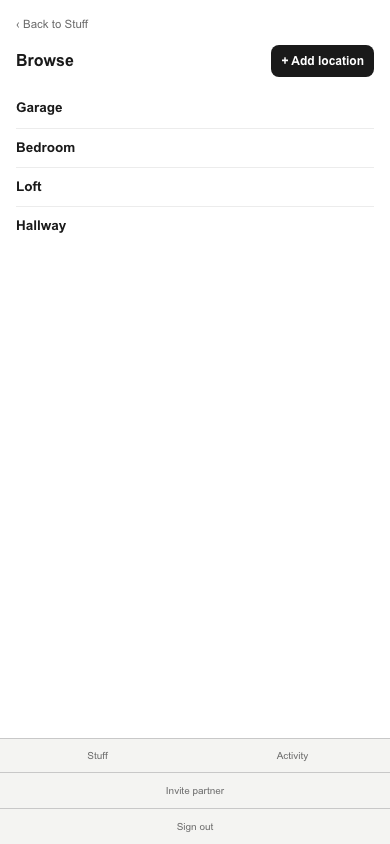
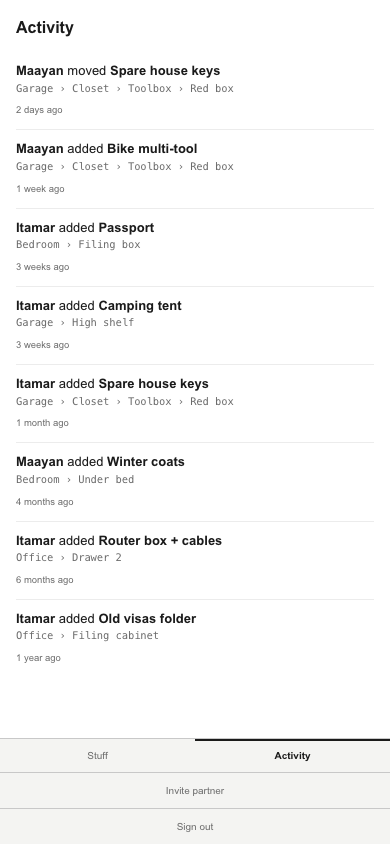

# Stuff Locator

A mobile-first PWA where a couple shares one household inventory of ~20–50 hard-to-find items — spare keys, the passport, the camping tent, the cable for the thing you use twice a year. Add an item with its room, its container and a free-text "where exactly"; find it later by whatever you happen to call it today; browse everything in a given place; and see who moved what, and when.

It is deliberately **not** a whole-house inventory. The failure mode for this category is cataloguing everything, spending two hours on the kitchen, and quitting before reaching anything you'd ever actually search for. Twenty items you'd genuinely lose is more useful than five hundred you wouldn't.

**Live demo:** [TODO: add live URL once deployed]

## Screenshots

| Find — everything, searchable, with full location paths | Stash — autocomplete over full paths |
|---|---|
|  |  |

| Browse — by place | Catch up — who moved what |
|---|---|
|  |  |

The Stash shot is the one worth a second look: typing `red` reaches `Garage › Closet › Toolbox › Red box` in three characters. Autocomplete runs over **full paths** rather than as a cascading picker, which is what stops arbitrary nesting from becoming a usability tax — and what stops "garage", "Garage" and "the garage" becoming three different places.

## Core flows

1. **Stash** — record an item, its room, its container, and a free-text "where exactly"
2. **Find** — search the household's items from the home screen
3. **Browse** — everything in a given room or container, including anything nested below it
4. **Catch up** — what changed, and who changed it

## What's built

Working against real data, with row-level security scoping every read and write to the caller's household:

- **Auth** — sign up, sign in, sign out, password reset by email
- **Households** — every new account is bootstrapped into one; items and locations belong to the *household*, not to a user
- **Stash / Home / Browse / item detail / edit / delete** — real reads and writes
- **Invite a partner** — generate a link, redeem it, land in the inviter's household
- **PWA** — installable, with a service worker and an offline fallback

Two things differ from the product design and are called out rather than glossed:

- **Find is a case-insensitive substring filter today**, not the in-browser embedding search the design calls for. The `transformers.js` version is a future swap behind the same `(items, query) => items` signature, not a rewrite of the caller.
- **The Activity feed still renders fixtures** rather than real provenance rows.

## Architecture worth knowing about

- **Locations self-reference.** A location has an optional `parent_id`, so `garage → closet → toolbox → red box → keys` is representable. "Everything in the garage" is a recursive CTE over the subtree; cycle prevention on move happens server-side, under lock. The UI stays shallow by default — depth is available, never demanded.
- **Atomic operations are Postgres functions, not TypeScript.** `supabase-js` goes through PostgREST, which wraps each request in its own transaction, so two SDK calls can never be atomic together. The operations that carry an invariant are `plpgsql` functions invoked via `.rpc()`: `create_household`, `move_item`, `location_subtree_items` and `redeem_invite` are wired up today; `move_container` and `delete_container` are written and migrated but have no caller yet, because the container-management UI they serve isn't built. A single item's delete is a plain `DELETE` — it carries no cross-table invariant, so it doesn't need one.
- **RLS is the enforcement boundary, and the app never holds a service-role key.** Server-side clients are built from the caller's session cookie and forward their JWT, so the same policies apply on the server as in the browser. The one operation that has to act outside the caller's own permissions — `redeem_invite`, where the caller isn't a member of the household yet — is `SECURITY DEFINER` in Postgres rather than a privileged client in Node. `src/lib/env.ts` doesn't even accept a service-role key; only the test harness uses one, to seed rows.
- **Reads go direct, invariant-carrying writes go through route handlers.** No ORM; Drizzle was considered and rejected.

Decisions are recorded as ADRs in [`docs/adr/`](./docs/adr). Fuller product and architecture context lives in [`CLAUDE.md`](./CLAUDE.md).

## Stack

| | |
|---|---|
| Framework | Next.js 16 (App Router, `proxy.ts`), React 19 |
| Language | TypeScript 5, `strict` |
| Styling | Tailwind CSS v4 |
| Backend | Supabase — Auth + Postgres only, RLS on every table |
| Migrations | Supabase CLI, versioned in `supabase/migrations/`, never the dashboard |
| PWA | serwist |
| Forms/validation | zod, downshift (autocomplete) |
| Unit/component tests | Vitest + Testing Library |
| E2E | Playwright (chromium) + axe-core |
| CI | GitHub Actions — typecheck, lint, test, build, e2e against a real local Supabase stack |

No LLM, no API key, no external search service.

## Prerequisites

- Node.js 22+
- [Docker](https://www.docker.com/) — required for the local Supabase stack

## Setup

```bash
npm install
cp .env.example .env.local   # fill in from `npx supabase status -o env`
npm run supabase:start       # requires Docker; applies every migration
npm run dev
```

`src/lib/database.types.ts` is generated from the real local schema — regenerate it (`npm run db:types`) after any new migration.

## Scripts

| Command | What it does |
|---|---|
| `npm run dev` | Start the dev server |
| `npm run build` | Production build |
| `npm run start` | Serve a production build |
| `npm run lint` | ESLint (Next config + typescript-eslint strict + jsx-a11y) |
| `npm run typecheck` | `next typegen && tsc --noEmit` |
| `npm run test` | Unit/component suite, once (Vitest) |
| `npm run test:watch` | Vitest in watch mode |
| `npm run test:rls` | RLS household-isolation integration test — needs `npm run supabase:start`; auto-loads `SUPABASE_URL`/`SUPABASE_ANON_KEY`/`SUPABASE_SERVICE_ROLE_KEY` from a gitignored `.env.rls.local` if present (write one once, from `npx supabase status -o env`), otherwise export them yourself |
| `npm run test:e2e` | Playwright end-to-end suite (builds, boots the app, drives it). Needs a real backend — run `npm run supabase:start` first — and the same `.env.rls.local` values, auto-loaded the same way |
| `npm run supabase:start` / `:stop` | Local Supabase stack (Postgres + Auth + PostgREST) |
| `npm run db:types` | Regenerate `src/lib/database.types.ts` from the local schema |

## Layout

```
src/app/**              Routes. Server Components read through src/server/db;
                        Client Components use the browser client instead
src/app/api/**          HTTP boundary — route handlers for invariant-carrying writes
src/server/services/**  Validation, authorisation, orchestration
src/server/db/**        Supabase client factories (browser + server, JWT-forwarding)
src/lib/**              Env validation, shared types, pure helpers
supabase/migrations/**  Schema, RLS policies, plpgsql functions
docs/adr/**             Architecture decision records
e2e/**                  Playwright specs
```
